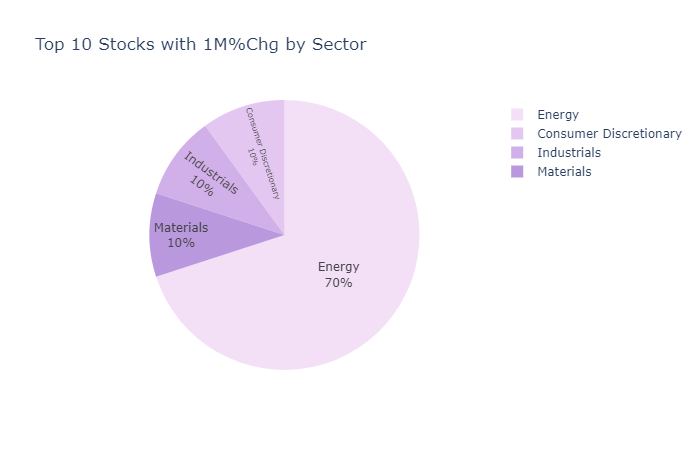

# The Top Ten

## Introduction

The primary focus of this ETL project is to update you on the top ten best performing stocks of the S&P 500 per fiscal quarter. This information is then matched with each company's respected sector to identify which sectors are out-perfoming. For example, in Q2 2020, the company Fedex (FDX) is up +95.01% ranking #07 in the Top 10 Year-to-Date stocks of the S&P 500 thus far. Click <a href ="https://jakebyford.github.io/sp500/SP500_ETL_Pandas/Solved/index.html"><strong>HERE</strong></a> to view the dashboard.

## Step 1: System Requirements

Python Version 3.76

## Step 2: Installation

Use 'pip' to install necessary modules in environment.

- The command below installs all necessary requirements need be.

```bash
$ pip install -r requirements.txt
```

## Step 3: Obtain required API Key & Secret Key

- After obtaining keys from https://alpaca.markets/, copy that key into the config.py file.\
  
- Be sure to stay on the Overview page when you run the notebook or you will lose your secret key. API Keys are on the right side.

## Step 4: Run the application

Clone the project to local computer/device.
Run 'S & P ETL Project.ipynb' .\
\

